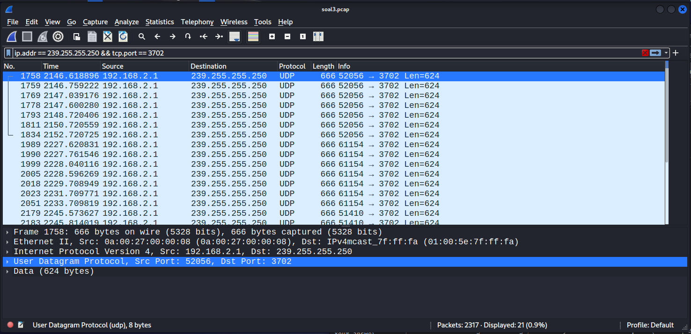
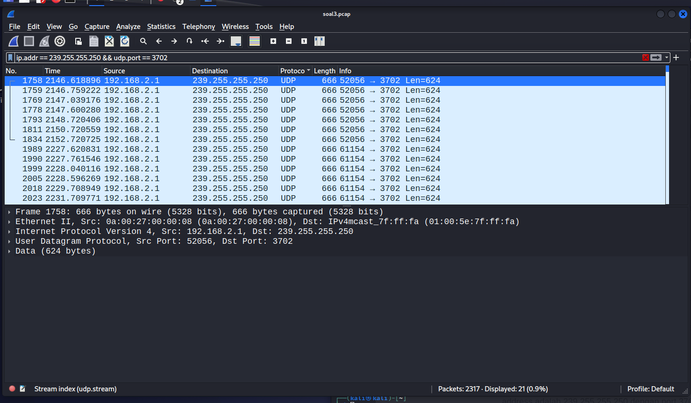
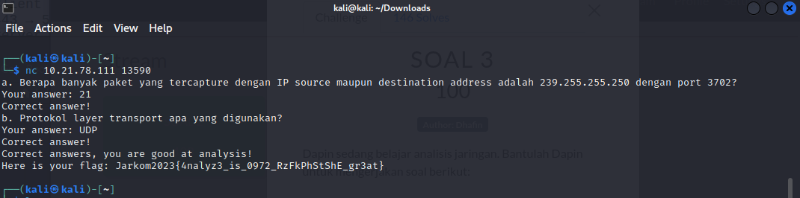
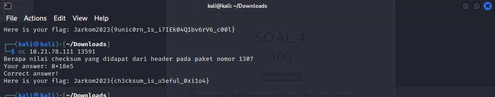
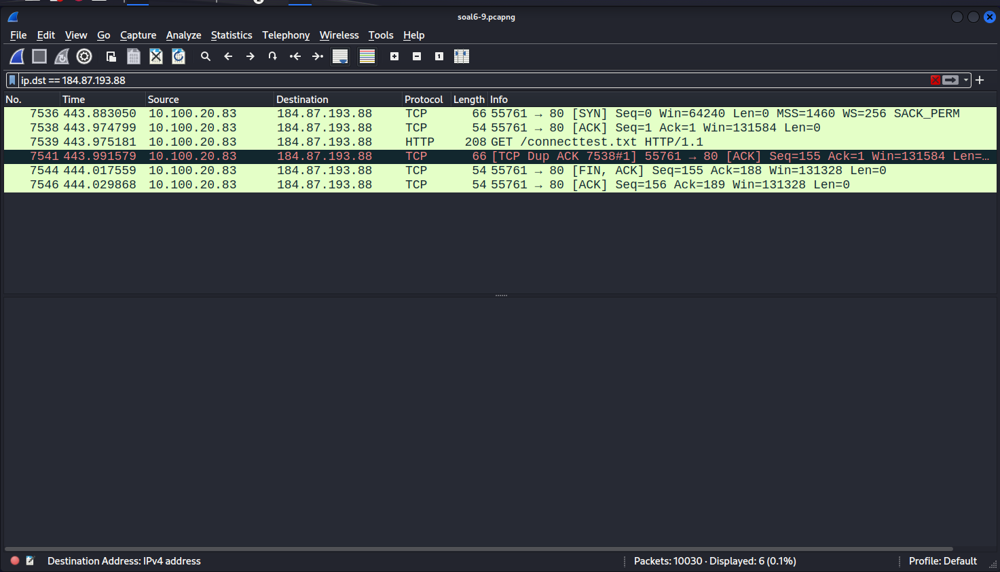
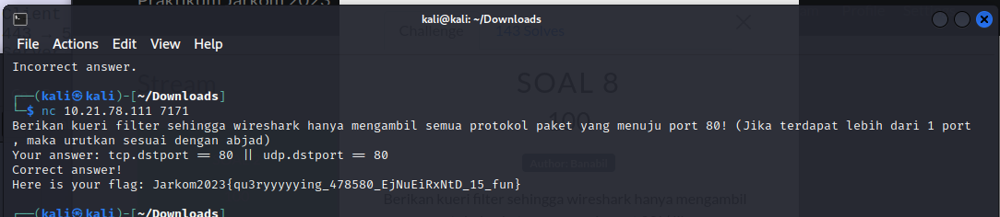
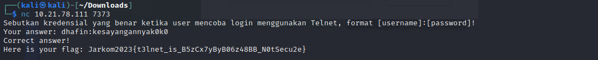

# Laporan Resmi Praktikum 1 E01
|Anggota        |NRP        |
|---------------|-----------|
|Hammuda Arsyad |5025211146 |

## 1

Soal: 

### *User melakukan berbagai aktivitas dengan menggunakan protokol FTP. Salah satunya adalah mengunggah suatu file.*

karena yang diminta adalah aktifitas mengunggah, maka command ftp yang digunakan adalah STOR

Sehingga untuk mencari paket yang menggunakan command STOR gunakan filter berikut:
```
ftp contains "STOR"
```


> Kendala yang saya alami adalah menggunakan referensi command clients yang tidak standar (send, put), dan tidak menggunakan raw command yang telah diatur oleh IETF sendiri (STOR)

Pada ncat yang diberikan terdapat beberapa sub soal:

### *a. Berapakah sequence number (raw) pada packet yang menunjukkan aktivitas tersebut?*

* Dapat ditemukan pada bagian `Transmission Control Protocol`
    ```
    Sequence Number (raw): 258040667
    ```


### *b. Berapakah acknowledge number (raw) pada packet yang menunjukkan aktivitas tersebut?*

* Dapat ditemukan pada bagian `Transmission Control Protocol`
    ```
    Acknowledgment number (raw): 1044861039
    ```


### *c. Berapakah sequence number (raw) pada packet yang menunjukkan response dari aktivitas tersebut?*

* Dengan menggunakan `follow tcp stream`, kita akan diarahkan ke paket respons secara langsung
* Kemudian, seq number raw dapat ditemukan pada bagian `Transmission Control Protocol`
    ```
    Sequence Number (raw): 1044861039
    ```


### *d. Berapakah acknowledge number (raw) pada packet yang menunjukkan response dari aktivitas tersebut?*

* Dapat ditemukan pada bagian `Transmission Control Protocol`
    ```
    Acknowledgment number (raw): 258040696
    ```


Setelah semua subsoal telah dijawab maka flag akan diberikan.


## 2

Soal:

### *Sebutkan web server yang digunakan pada portal praktikum Jaringan Komputer!*

Karena ip dari web praktikum diketahui maka dapat di cari menggunakan filter berikut:
```
ip.addr == 10.21.78.111 && http contains "Praktikum"
```

pilih paket yang berisi `200 ok` yang artinya request berhasil,

pada bagian `Hypertext Transfer Protocol` terdapat field `Server` dengan value nama dari web server yang digunakan

value tersebut dapat dimasukkan kedalam netcat pada soal dan akan didapatkan flag


## 3

Soal:

Diberikan netcat, didalamnya ada 2 subsoal

### *a. Berapa banyak paket yang tercapture dengan IP source maupun destination address adalah 239.255.255.250 dengan port 3702?*

* Dapat menggunakan filter berikut:
    ```
    ip.addr == 239.255.255.250 && udp.port == 3702
    ```

* Jumlah paket dapat dilihat pada bagian bawah window wireshark



    > Dapat menggunakan fungsi statistic dari wireshark dengan menuju tab statistic -> ipv4 Statistics -> destination and ports

### *b. Protokol layer transport apa yang digunakan?*

* Dapat dilihat secara langsung maupun dari analitics bahwa protocol yang menggunakan port 3702 pada ip 239.255.255.250 adalah 
    ```
    UDP
    ```



Setelah menjawab kedua subsoal diatas flag akan diberikan



## 4

### *Berapa nilai checksum yang didapat dari header pada paket nomor 130?*

Untuk menuju paket tertentu dapat menggunakan hotkeys `ctrl + g` dan masukkan 130

Checksum paket yang dimaksud ada pada bagian `User Datagram Protocol`


Masukkan value checksum pada netcat pada soal dan akan didapatkan flagnya



## 5

Diberikan file pcap dan protected zip

password dari file zip dapat ditemukan menggunakan 

Soal:


## 6 (REVISI)

Soal:

### *Seorang anak bernama Udin Berteman dengan SlameT yang merupakan seorang penggemar film detektif. sebagai teman yang baik, Ia selalu mengajak slamet untuk bermain valoranT bersama. suatu malam, terjadi sebuah hal yang tak terdUga. ketika udin mereka membuka game tersebut, laptop udin menunjukkan sebuah field text dan Sebuah kode Invalid bertuliskan "server SOURCE ADDRESS 7812 is invalid". ketika ditelusuri di google, hasil pencarian hanya menampilkan a1 e5 u21. jiwa detektif slamet pun bergejolak. bantulah udin dan slamet untuk menemukan solusi kode error tersebut.*

* "a1 e5 u21" dapat diartikan substitution cypher dimana tiap huruf diganti menjadi representasi angkanya sesuai urutan alfabet, ataupun sebaliknya.

* "SOURCE ADDRESS 7812" dapat diartikan bahwa source ip dari paket nomor 7812 perlu diperhatikan

Dari kedua petunjuk diatas dapat disimpulkan bahwa kita perlu melakukan substitusi terhadap source ip dari paket nomor 7812

Hasilnya adalah:
```
104.18.14.101 
    = 10 4 18 14 10 1 
    = J D R N J A
```

Masukkan hasil yang didapat (huruf balok tanpa spasi) kedalam netcat yang diberikan, maka flag akan didapatkan


## 7
Soal:
### *Berapa jumlah packet yang menuju IP 184.87.193.88?*

Dapat menggunakan filter berikut:
```
ip.dst == 184.87.193.88
```

Jumlah paket dapat dilihat pada bagian bawah window wireshark



> Dapat juga menggunakan fungsi statistics wireshark dengan memilih opsi: analitics -> ipv4 Statistics -> all addresses


## 8

Soal:

### *Berikan kueri filter sehingga wireshark hanya mengambil semua protokol paket yang menuju port 80! (Jika terdapat lebih dari 1 port, maka urutkan sesuai dengan abjad)*

* Filter port tcp dengan menggunakan filter berikut:
    ```
    tcp.dstport == 80
    ```

* Filter port udp menggunakan filter berikut:
    ```
    udp.dstport == 80
    ```

Gabungkan kedua filter tersebut menggunakan operrand or

```
tcp.dstport == 80 || udp.dstport == 80
```


masukkab kedalam netcat yang ada pada soal dan flag akan ditemukan



## 9

Soal: 

### *Berikan kueri filter sehingga wireshark hanya mengambil paket yang berasal dari alamat 10.51.40.1 tetapi tidak menuju ke alamat 10.39.55.34!*

* Filter ip 10.51.40.1 menggunakan filter berikut:
    ```
    ip.src == 10.51.40.1
    ```

* Filter ip 10.39.55.34 menggunakan filter berikut:
    ```
    ip.dst != 10.39.55.34
    ```

Gabungkan kedua filter tersebut menggunakan operrand and

```
ip.src == 10.51.40.1 && ip.dst != 10.39.55.34
```

masukkab kedalam netcat yang ada pada soal dan flag akan ditemukan


## 10

Soal:

### *Sebutkan kredensial yang benar ketika user mencoba login menggunakan Telnet!*

filter paket sehingga hanya menampilkan protokol telnet dengan filter berikut:
```
telnet
```

> Kendala yang saya alami pada soal ini adalah salah paham bahwa paket berisi username dan password hanyalah data biasa dan belum terjamin kebenarannya sehingga perlu mencari paket yang menunjukkan aktifitas user login itu sendiri

untuk mendapatkan aktifitas login user telnet dapat menggunakan filter berikut:
```
telnet contains "Login"
```

kemudian lakukan follow tcp stream dan filter sehingga hanya menampilkan dialog server

akan didapatkan username dan password pada baris awal stream


Masukkan credential yang didapatkan kedalam netcat pada soal sesuai format yang tertera, setelah itu akan diberikan flagnya




